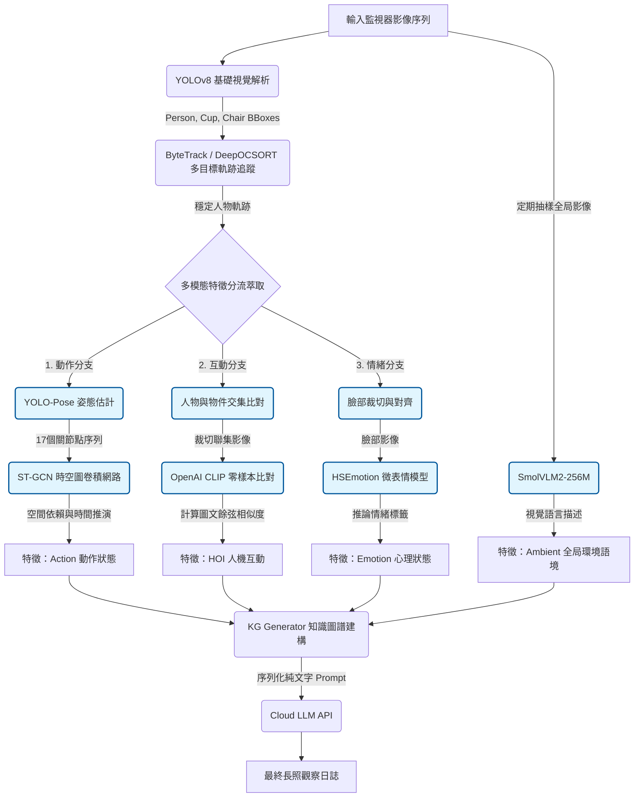

# 第一代系統 (Eldercare System 1)：ST-GCN 與基礎多模態架構

## 摘要 (Abstract)
在高齡照護環境中進行人體行為識別與分析，往往面臨極端攝影機視角、嚴重遮蔽，以及需要多模態推理等特殊挑戰。本文介紹 **EldercareSystem1**，這是我們為端到端 (End-to-End) 多模態行為分析建立的第一代概念驗證 (PoC) 框架。本系統建構了一個模組化的處理管線，整合了時空圖卷積神經網路 (ST-GCN) 進行基於骨架的動作辨識、對比語言-影像預訓練模型 (CLIP) 進行零樣本的人機互動 (HOI) 推理，以及 HSEmotion 進行微表情分析。儘管本系統成功建立了長照監視的基礎架構，但也暴露出基於圖結構的姿態處理在長照場景的致命缺陷，以及零樣本推論產生的嚴重幻覺問題。

---

## 1. 系統架構與詳細流程圖
System 1 的處理管線採取並行處理的多模態特徵萃取策略。畫面輸入後，同時分流至骨架動作分析、人機互動判定以及微表情解析模組，最後將所有特徵序列化並由大語言模型進行語意匯整。

## 2. 核心技術與研究方法 (Methodology)

### 2.1 基礎視覺解析與軌跡追蹤 (MOT)
系統首先部署 `YOLOv8` 作為主要物件偵測器，提取關鍵類別（人物、水杯、椅子等）的邊界框 $\mathcal{B}$。為了確保時間序列上的個體一致性，我們整合了 `ByteTrack` 演算法，透過卡爾曼濾波 (Kalman Filtering) 預測運動軌跡，並利用 IoU 進行關聯，賦予每個人物獨立的軌跡 ID。

### 2.2 時空圖卷積網路 (ST-GCN)
針對動作辨識，系統使用 `YOLO-Pose` 提取 17 個 COCO 格式的 2D 關節點。這些關節點構成了一個時空圖 $\mathcal{G}$。在 ST-GCN 中，圖卷積操作允許神經網路捕捉關節點之間的自然物理連結（例如手肘連接到手腕），並透過時間卷積 (Temporal Convolution) 分析連續影格間的變化。
其數學核心為對頂點 $v_i$ 進行鄰域聚合，藉此捕捉空間結構與時間動態。

### 2.3 零樣本 人機互動推論 (Zero-Shot HOI)
為了辨識「喝水」等複雜動作，系統計算人物與物件邊界框的交集。若存在交集，則將該區域裁切並送入 `OpenAI CLIP` 模型。系統透過計算裁切影像特徵 $E_{img}$ 與特定互動文字提示（如 "drinking water"）特徵 $E_{text}$ 之間的餘弦相似度 (Cosine Similarity)，來判定該互動是否成立。

## 3. 遭遇痛點與消融分析 (Ablation Analysis)
儘管概念驗證成功，但 System 1 在真實長照場景中暴露出以下嚴重的技術限制：

1. **圖結構拓樸的領域差異 (Domain Gap in Graph Topologies)**：
   ST-GCN 極度依賴人體關節的「絕對空間拓樸」。長照監視器通常裝設在天花板角落（高俯視角），這會導致下半身關節嚴重縮短甚至消失。ST-GCN 的圖卷積在此種畸變的骨架輸入下幾乎完全失效，導致基礎動作（如坐下、站立）的辨識準確率暴跌。
2. **CLIP 的零樣本幻覺 (Zero-Shot Hallucination)**：
   由於系統僅仰賴單一 CLIP 模型進行特徵匹配，缺乏交叉驗證機制。只要長輩的手剛好揮過水杯上方，CLIP 就極容易因為「空間接近」而誤判為「正在喝水」。
3. **主觀情緒對大模型的毒化 (Subjective Poisoning)**：
   `HSEmotion` 經常因為監視器畫質低落或長輩發呆，而錯誤輸出「悲傷」或「憤怒」的標籤。大語言模型 (LLM) 接收到這些錯誤提示後，會試圖將上下文合理化，進而憑空捏造出「長輩心情不佳，建議社工介入」等嚴重偏離客觀事實的幻覺報告。
