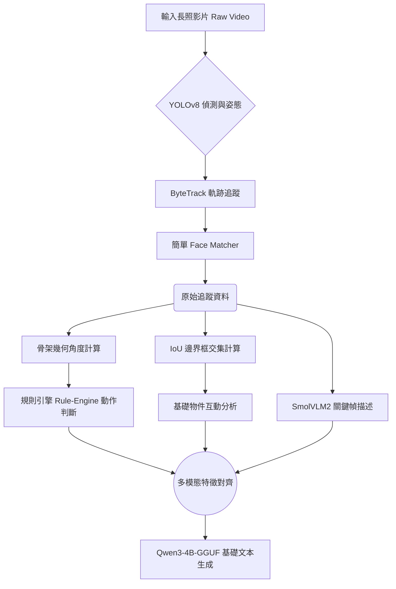

# EldercareSystem1: 基礎啟發式與空間軌跡系統

## 1. 系統定位 (System Positioning)
EldercareSystem1 是本長照監控專案的初代理論驗證模型 (Proof-of-Concept)。其主要目的為驗證邊緣運算 (Edge AI) 設備是否能在不依賴外部伺服器的情況下，完成基礎的人物追蹤與行為記錄。本系統大量依賴啟發式規則 (Heuristic Rules) 而非深度學習分類，架構簡單且運算速度極快，但精準度有限。

## 2. 系統架構設計 (System Architecture)
System 1 依賴最原始的二維空間軌跡作為判斷依據。

### 2.1 感知層 (Perception Layer)
1. **多目標追蹤 (Tracking)**
   - **YOLOv8 + ByteTrack**: 負責 2D 空間追蹤。這是整個系統最穩固的基石。
   - **基礎 Face Matcher**: 依賴簡單的人臉比對，缺乏遮蔽與背對處理機制，因此容易產生「Unknown」斷層。

2. **基礎特徵提取**
   - **YOLO-Pose**: 採用 YOLO 原生的 Pose 預測，提取 2D 骨架座標。
   - 捨棄了複雜的 HOI 模型，改以簡單的「邊界框交集 (IoU)」來判斷人物是否正在使用某項物品（例如：人框與水杯框重疊即視為 Holding）。

### 2.2 事件聚合層 (Event Generation Layer)
1. **規則引擎動作辨識 (Rule-Based Action Recognition)**
   - 系統並未使用深度學習模型來分類行為。
   - **判定邏輯**: 透過計算大腿與小腿的夾角、骨盆高度是否低於特定閾值 (Threshold)，來硬編碼 (Hard-code) 判斷長者是「坐著 (Sitting)」、「站立 (Standing)」或「跌倒 (Fall)」。
   - **缺點**: 由於攝影機視角與長者身高的多樣性，規則引擎在實際應用中極易失效。

### 2.3 語意融合層 (Semantics Layer)
1. **SmolVLM2-256M 視覺描述**
   - 從少數關鍵幀中擷取粗略場景資訊。
2. **Qwen3-4B-Instruct-GGUF**
   - 由於感測器傳來的資料雜訊極高且缺乏連貫性，LLM 大多時候只能進行保守的基礎紀錄。

## 3. 系統執行流程圖 (Pipeline Flowchart)

## 4. 局限性與進化方向 (Limitations)
- **規則脆弱性**: 啟發式規則無法適應遮蔽與不同身型，這促使了後續 System 2/3 向純粹機器學習 (ML-based) 分類的演進。
- **身分斷層**: 缺乏跨鏡頭與背對處理的 ReID，使得追蹤常常中斷，導致報告破碎。
