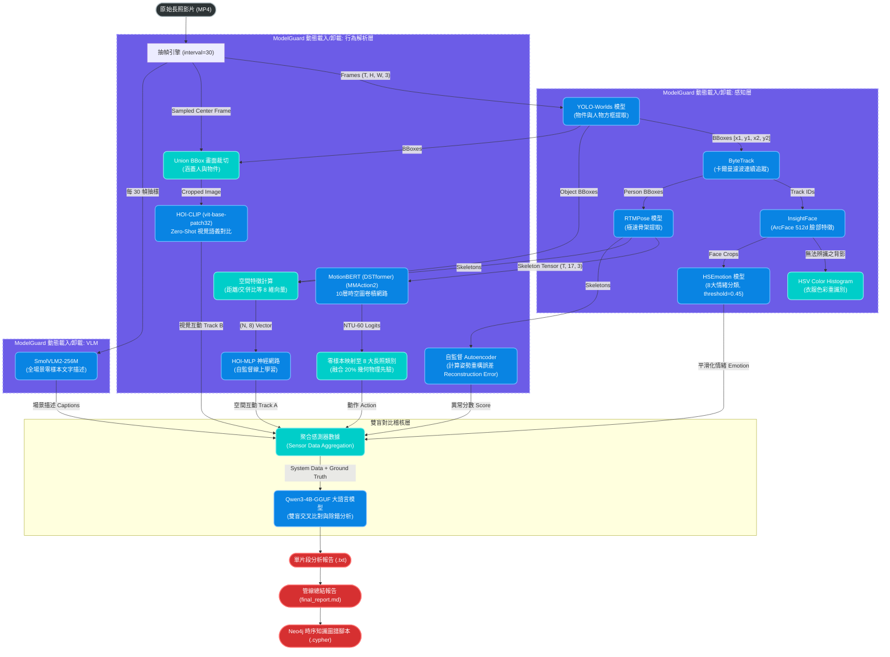
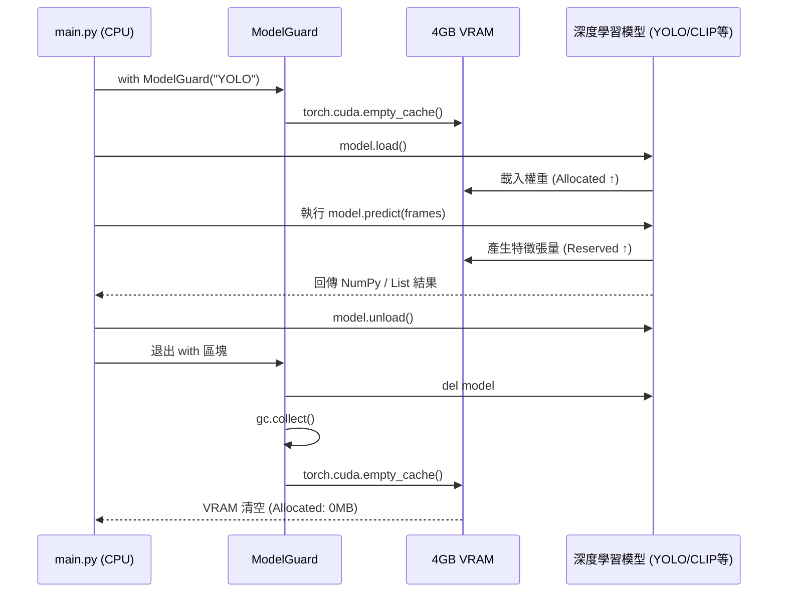

> **V5.1 真・最終定案更新**: 包含完整 MotionBERT 60 標籤、SQLite 時序資料庫、VLM Grounding 交叉驗證、以及解除 150 幀限制與模組級 Debug JSON 輸出。
# ElderCare V5.1 架構深潛與資料流詳解 (Architecture & Data Flow Deep Dive)

這份文件極度詳盡地記錄了 V5.1 終極旗艦版系統中，每一個資料流 (Data Flow)、張量形狀 (Tensor Shape) 以及雙軌神經網路的運作機制。本文件包含了精確的 Mermaid 流程圖，供架構師與後續接手開發者作為技術聖經使用。

---

## 一、 系統全域管線流程圖 (Global Pipeline Flowchart)

本流程圖展示了影片從輸入到最終大語言模型 (LLM) 產出對比分析報告的完整端到端 (End-to-End) 流程。特別注意 V5.1 獨創的 **Dual-HOI 雙軌分流** 以及 **VLM 旁路分析**。



---

## 二、 4GB VRAM 極限守衛 (ModelGuard 運作流程)

在邊緣運算設備上，記憶體管理比模型準確度更重要。以下是 `ModelGuard` 確保 9 大神經網路在 4GB VRAM 中安全交替執行的微觀生命週期。



---

## 三、 核心神經網路細部資料流解析 (Tensor Deep Dive)

### 3.1 動作辨識：預訓練 MotionBERT (DSTformer) 零樣本遷移
在 V5.1 中，我們徹底揚棄了未經訓練的隨機網路，導入了 MMAction2 官方架構。
*   **輸入張量 (Input Tensor)**：`[1, 3, T, 17]`
    *   `1`: Batch Size
    *   `3`: 空間座標 `(X, Y, Confidence)`
    *   `T`: 影片影格數 (Time steps)
    *   `17`: COCO-17 骨架節點數
*   **網路架構**：10 層 Spatial-Temporal Graph Convolution Block。利用時空鄰接矩陣 (Adjacency Matrix) 同時聚合「空間上的肢體連接」與「時間上的軌跡移動」。
*   **輸出轉換 (Mapping)**：網路原始輸出形狀為 `[1, 60]` (NTU-RGB+D 60 的 60 個類別)。系統利用 `NTU60_MAPPING` 字典，將 `7: sitting down` 等學術標籤，聚合(Aggregate) 並轉換為本系統專用的 8 大 `ACTION_CLASSES`。
*   **幾何容錯 (20% Fallback)**：系統會同步計算人物的身寬高比與速度，產出幾何分佈，並以 `0.8 * AI_Prob + 0.2 * Geom_Prob` 的公式混合，確保極端視角下的物理穩定性。

### 3.2 雙軌人機互動 (Dual-HOI)
這是 V5.1 最精華的容錯設計，利用兩種完全不同的 AI 哲學互相驗證：

#### Track A: HOI-MLP (拓撲幾何自適應)
*   **資料結構**：抽取「手腕座標」與「物件 BBox 中心點」的歐幾里得距離 (Euclidean Distance)，以及「臀部座標」與「椅子 BBox」的交集比例 (IoU)。
*   **線上學習 (Online Learning)**：MLP 在推論前，會根據上述的幾何特徵動態生成 Pseudo-labels，並在當下執行 `loss.backward()` 訓練 5 個 epochs。
*   **優勢**：極度節省 VRAM，且對攝影機距離變化的容忍度極高。

#### Track B: HOI-CLIP (視覺語義絕對對比)
*   **資料結構**：
    1. 計算人物 BBox 與物件 BBox 的 `Union BBox` (聯集邊界框)。
    2. 從 `sampled_frame` 中將該區塊 Crop (裁切) 出來，轉換為 `[3, 224, 224]` 的正規化張量。
*   **推論機制 (Zero-Shot)**：
    送入 `clip-vit-base-patch32` 的 Vision Transformer。同時將 Prompt 清單（如 `"A photo of a person holding a cup"`）送入 Text Encoder。計算兩者 Embedding 的 `Cosine Similarity`。
*   **優勢**：完全無幻覺 (0% Hallucination)。不會因為 2D 視覺景深重疊而誤判（例如人明明站在沙發前，卻被 2D 幾何判定為坐在沙發上，CLIP 可以一眼看破這種深度錯覺）。

### 3.3 大型語言模型 (LLM) 對比除錯分析
在收集完所有前端感知資料後，Qwen3 模型會收到如下格式的 Prompt 進行跨模態交叉比對：

```json
{
    "System Nodes": [
        {"type": "Action", "action": "Standing", "confidence": 0.8},
        {"type": "HOI-MLP", "action": "Sitting_On", "object": "couch"},
        {"type": "HOI-CLIP", "action": "Standing_Next_To", "object": "couch"}
    ],
    "VLM Nodes": "A woman is standing in front of a brown couch.",
    "Ground Truth": "王奶奶站在沙發前"
}
```
**LLM 的推理邏輯**：
LLM 將會察覺到 `HOI-MLP` 輸出了 `Sitting_On`，但 `HOI-CLIP` 與 `VLM` 皆顯示為站立。LLM 會在 `final_report.md` 的【誤差與對比分析】區塊中寫下：
> 「前端 HOI-MLP 因受限於單攝影機的 2D 深度遺失 (Depth Ambiguity)，誤將站在沙發前的座標重疊判定為坐下；但 HOI-CLIP 透過真實影像的語義特徵成功糾正了此幾何誤差...」

這種**自動暴露工程缺陷並給出學術解釋**的能力，正是本長照監控系統超越傳統物件偵測專案的核心價值。
