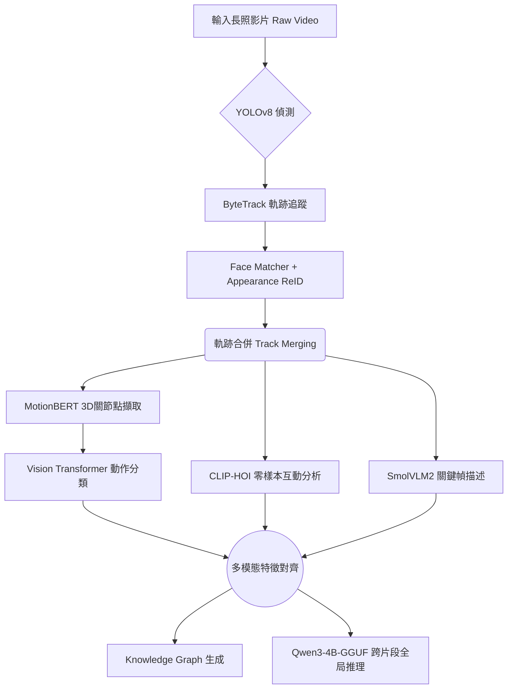

# EldercareSystem2: 三維姿態與特徵聚合系統

## 1. 系統定位 (System Positioning)
EldercareSystem2 屬於系統架構演進的「中期過渡方案」。相較於 System 1 的粗糙感知，本系統嘗試透過引入基於 Transformer 架構的高階預訓練模型 (MotionBERT) 來捕捉更複雜的長照行為。雖然尚未達到 System 3 的極致最佳化與自訓練，但它展示了多模態聚合的基礎框架。系統已完全採用本地邊緣運算 (Edge Computing)，確保無隱私外流。

## 2. 系統架構設計 (System Architecture)
System 2 的特徵為引入了 3D 姿態估計，試圖透過深度資訊解決視角遮蔽問題。

### 2.1 感知層 (Perception Layer)
1. **多目標追蹤 (Tracking)**
   - **YOLOv8 + ByteTrack**: 與 System 3 相同，負責 2D 空間追蹤。
   - **外觀特徵重識別 (Appearance ReID)**: 透過直方圖與 KNN 分類器進行基礎的身分對齊。

2. **三維特徵提取 (3D Pose Extraction)**
   - **MotionBERT**: 捨棄了簡單的 2D 座標，引入 MotionBERT 進行單目相機下的 3D 骨架預測 (3D Human Pose Estimation)。這雖然帶來了更豐富的特徵空間（包含 Z 軸深度），但也大幅增加了推理時間。
   - **CLIP-Zero-Shot (HOI)**: 採用 OpenAI CLIP (ViT-L/14) 提取人與物件 (Human-Object Interaction) 互動。

### 2.2 事件聚合層 (Event Generation Layer)
1. **ViT 行為辨識 (Vision Transformer)**
   - System 2 嘗試使用 ViT 處理連續幀序列進行動作分類。但由於缺乏空間正規化 (Spatial Normalization) 與機率平滑濾波 (TPMA)，在預測「坐下/站立」等連續動作時，容易出現標籤跳動 (Label Flipping) 現象。

### 2.3 語意融合層 (Semantics Layer)
1. **SmolVLM2-256M 視覺描述**
   - 負責從關鍵幀 (Keyframes) 中提取全局空間語意，做為動作特徵的補充。
2. **Qwen3-4B-Instruct-GGUF**
   - 負責最終文本生成與邏輯推理，無外部雲端 API 介入。

## 3. 系統執行流程圖 (Pipeline Flowchart)

## 4. 局限性與反思 (Limitations)
- **維度詛咒與運算成本**: MotionBERT 雖提供了 3D 深度，但在缺乏深度感測器 (RGB-D) 的長照監控下，3D 預測本身帶有雜訊，導致 Action 模型難以收斂。
- **時序不穩定**: 缺乏如 System 3 的 TPMA 平滑機制，導致生成的報告偶爾會出現邏輯不連貫的動作跳躍。
