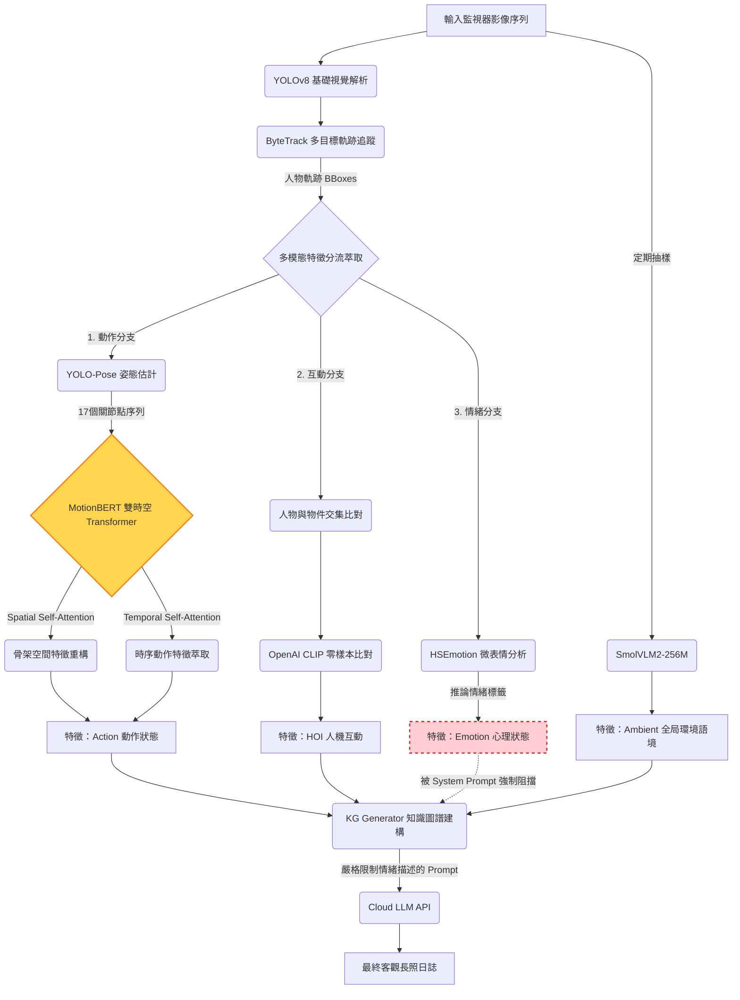

# 第二代系統 (Eldercare System 2)：導入 MotionBERT 嘗試突破骨架瓶頸

## 摘要 (Abstract)
在未受限的真實長照環境中進行行為分析，克服人體姿態估計的視角差異 (Domain Gap) 以及壓制多模態大模型的幻覺現象是首要任務。**EldercareSystem2** 提出了一次典範轉移：捨棄了基於圖結構的卷積網路，改為導入強大的雙時空 Transformer (DSTformer) 架構——`MotionBERT`，以期透過全局注意力機制解決骨架畸變問題。此外，為了確保自動生成報告的醫療客觀性，我們實施了「物理客觀性解耦」機制，強硬排除主觀情緒推論。本文將詳細探討架構升級的數學原理，以及該模型在真實臨床監控中面臨的尺度變異與軌跡毒化挑戰。

---

## 1. 系統架構與詳細流程圖
System 2 繼承了初代系統的骨幹，但進行了關鍵模組的替換 (MotionBERT) 與邏輯過濾 (移除情緒特徵的 LLM 傳遞)。

## 2. 核心技術與研究方法 (Methodology)

### 2.1 雙時空 Transformer (DSTformer / MotionBERT)
為了解決 ST-GCN 遇到遮蔽與俯視角就崩潰的問題，系統導入了 `MotionBERT` 作為核心動作模型。MotionBERT 不依賴預設的骨架連接圖，而是透過 DSTformer (Dual Spatial-Temporal Transformer) 同時在「關節維度」與「時間維度」計算 Self-Attention (自注意力機制)。
給定由 `YOLO-Pose` 提取的 2D 關節點序列 $X \in \mathbb{R}^{T \times J \times 2}$，DSTformer 執行的注意力計算如下：
$$ \text{Attention}(Q, K, V) = \text{Softmax}\left(\frac{QK^T}{\sqrt{d_k}}\right)V $$
由於 Transformer 具備全局關聯能力，即使長輩下半身被桌子遮蔽，模型仍能透過上半身的傾斜角度與肩膀位置，推斷出整體的「坐下」動作，大幅提升了對長照殘缺畫面的寬容度。

### 2.2 嚴格物理客觀性解耦 (Strict Objective Decoupling)
為了根絕初代系統的 LLM 幻覺，System 2 從源頭斬斷主觀資訊。雖然 `HSEmotion` (`emotion_model.py`) 仍在背景運行（保留作為未來長期統計的潛在特徵），但其輸出的情緒標籤被禁止傳遞給知識圖譜與 LLM。
同時，在 `llm_report.py` 中，我們對語言模型注入了具備絕對約束力的 System Prompt：*「絕對禁止描述或推測長輩的心理感受與情緒，僅專注於客觀的物理動作。」*，成功將長照報告的屬性從「看圖說故事」拉回「嚴謹的醫療觀察」。

## 3. 遭遇痛點與技術瓶頸 (Limitations)

儘管 MotionBERT 在實驗室標準資料集 (如 NTU-RGB+D 120) 上表現驚人，但在實際佈署至長照現場後，仍暴露出三個關鍵缺陷：

1. **極端尺度變異 (Extreme Scale Variance)**：
   MotionBERT 是基於正規化的空間座標運作。當長輩在攝影機前（近大）或走廊深處（遠小）做同樣的動作時，像素層級的位移量相差數十倍。缺乏對於「絕對下沉速度」的物理編碼，導致模型經常分不清「靜止坐著 (Sitting)」與「正在坐下 (Sit down)」的差異。
2. **身份重識別毒化 (ReID Poisoning)**：
   System 2 依賴基於幀的 (Frame-by-frame) 身份辨識。然而，在長達數千幀的軌跡中，只要長輩有一瞬間轉側臉導致特徵誤判，追蹤演算法就會將這整條軌跡永遠更換為錯誤的身份（例如把陳爺爺錯認為王奶奶），造成無可挽回的報告災難。
3. **HOI 互動幻覺依存**：
   僅使用 CLIP 進行單階段特徵匹配，依然無法有效解決「空間重疊」但不代表「實際觸碰」的偽陽性判定。
