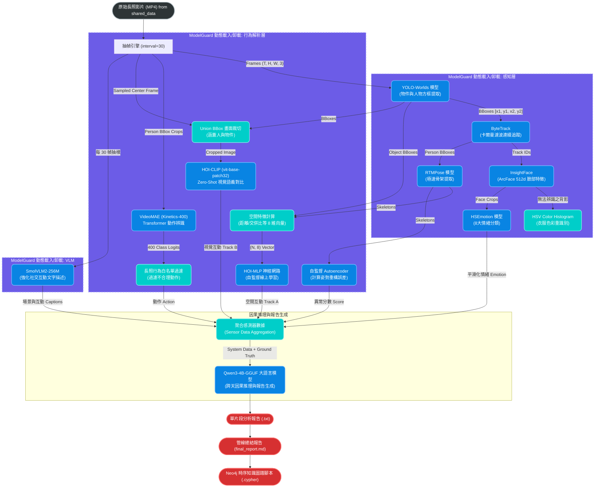
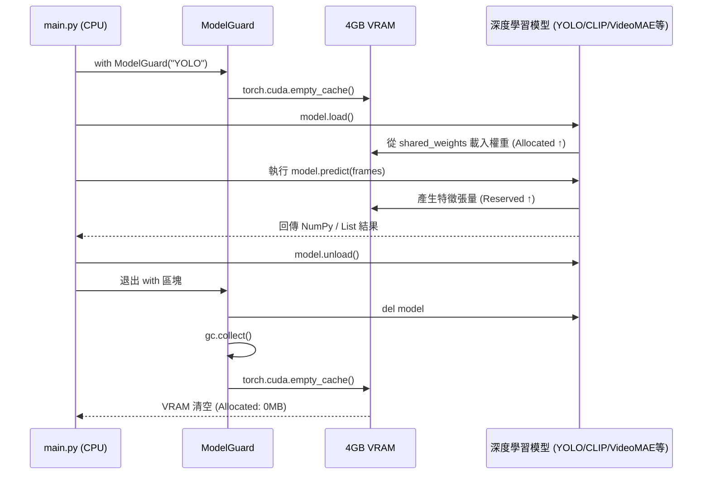

> **V6.0 真・最終定案更新**: 包含完整 VideoMAE (Kinetics-400) RGB 連續動作模型、長照行為白名單過濾、VLM 社交互動提示詞強化、SQLite 時序資料庫，以及 Shared Data 輕量化共用架構。
# ElderCare V6.0 架構深潛與資料流詳解 (Architecture & Data Flow Deep Dive)

這份文件極度詳盡地記錄了 V6.0 終極旗艦版系統中，每一個資料流 (Data Flow)、張量形狀 (Tensor Shape) 以及神經網路的運作機制。本文件包含了精確的 Mermaid 流程圖，供架構師與後續接手開發者作為技術聖經使用。

---

## 一、 系統全域管線流程圖 (Global Pipeline Flowchart)

本流程圖展示了影片從輸入到最終大語言模型 (LLM) 產出對比分析報告的完整端到端 (End-to-End) 流程。特別注意 V6.0 獨創的 **VideoMAE RGB 動作辨識** 以及 **VLM 社交互動強化**。

---

## 二、 4GB VRAM 極限守衛 (ModelGuard 運作流程)

在邊緣運算設備上，記憶體管理比模型準確度更重要。以下是 `ModelGuard` 確保所有神經網路在 4GB VRAM 中安全交替執行的微觀生命週期。

---

## 三、 核心神經網路細部資料流解析 (Tensor Deep Dive)

### 3.1 動作辨識：VideoMAE (Kinetics-400) RGB 連續模型
在 V6.0 中，我們徹底揚棄了不適應真實環境的 NTU-60 骨架模型，導入了真實影像訓練的 VideoMAE。
*   **輸入特徵**：由 YOLO + ByteTrack 擷取的人物 Bounding Box，直接從影片中裁切出 `(16, 3, 224, 224)` 的 RGB 影像序列。
*   **網路架構**：Vision Transformer (ViT) with Masked Autoencoder Pretraining。
*   **長照動作白名單 (Whitelist Filter)**：Kinetics-400 包含許多不合理的動作 (如 `snowboarding`, `shaving head`)。為了解決 BBox 裁切導致的 Context Loss，我們實作了 Logit Masking。模型輸出 `[1, 400]` 的 Logits 後，會把非長照行為的維度設為 `-inf`，強迫模型在 `reading book`, `laughing`, `sneezing` 等合理集合內做出最高信心度的選擇。

### 3.2 雙軌人機互動 (Dual-HOI)
這是本系統最精華的容錯設計，利用兩種完全不同的 AI 哲學互相驗證：

#### Track A: HOI-MLP (拓撲幾何自適應)
*   **資料結構**：抽取「手腕座標」與「物件 BBox 中心點」的歐幾里得距離，以及「臀部座標」與「椅子 BBox」的交集比例 (IoU)。
*   **優勢**：極度節省 VRAM，且對攝影機距離變化的容忍度極高。

#### Track B: HOI-CLIP (視覺語義絕對對比)
*   **資料結構**：計算人物 BBox 與物件 BBox 的 `Union BBox` (聯集邊界框)，送入 `clip-vit-base-patch32`。
*   **優勢**：完全無幻覺 (0% Hallucination)。不會因為 2D 視覺景深重疊而誤判。

### 3.3 視覺語言模型 (VLM) 社交互動強化
由於 VideoMAE 動作模型無法有效辨識 `Talking` 或 `Arguing` 等高階社交行為，V6.0 特別優化了 `SmolVLM2-256M` 的提示詞 (Prompt)。
*   **Prompt Engineering**：強制模型關注「social interactions (e.g., talking, arguing, ignoring each other, greeting)」。這使得系統無需撰寫任何死板的規則引擎，就能自然地將畫面中的人際互動轉換為文字紀錄。

### 3.4 大型語言模型 (LLM) 對比除錯分析
在收集完所有前端感知資料後，Qwen3 模型會收到動作、物件互動、情緒與 VLM 社交描述，進行跨模態交叉比對，並產出深具人性關懷的長照報告。
